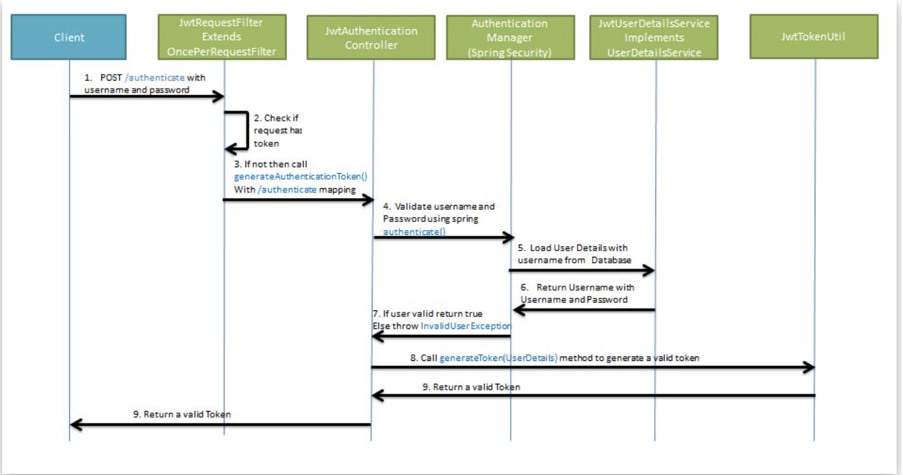

### Spring-Security 구현 - 3

* 프로젝트에 Spring Security, JWT 구현한다.

* /authenticate url로 `username`, `password` 정보와 함께 jwt 토큰요청
* 토큰이 존재하는지 체크
* 존재하지 않는다면 `generateAuthenticationToken()` 호출
* `username`, `password`를 `authenticate()`를 이용해 메서드 검증
* 검증을 위해 `UserDetails` 요청
* `username`, `password`이 다를경우 `invalidUserException` 발생
* `UserDetails`를 사용해 generateToken 호출 
* 토큰 반환

* 스프링 순환참조 문제
    - `순환참조` : 서로 다른 여러 빈들이 물고늘어져 계속 연결되어 있는 상태
~~~
┌─────┐
|  jwtRequestFilter defined in file [/Users/hwangjeonghyeon/IdeaProjects/shop/build/classes/java/main/com/hanshin/shop/config/security/jwt/JwtRequestFilter.class]
↑     ↓
|  jwtUserDetailsService defined in file [/Users/hwangjeonghyeon/IdeaProjects/shop/build/classes/java/main/com/hanshin/shop/config/security/jwt/JwtUserDetailsService.class]
↑     ↓
|  securityConfig defined in file [/Users/hwangjeonghyeon/IdeaProjects/shop/build/classes/java/main/com/hanshin/shop/config/security/SecurityConfig.class]
└─────┘
~~~
- 스프링은 어느 빈을 먼저 생성해야할지 결정하지 못하고 순환참조 오류가 발생
- 설계가 잘못
- `생성자 주입`했을 때 발생
- `해결 방법`
    - `순환참조의 고리 끊기`
    - @Lazy 사용
        - 권장하지않음
            - 프로그램 문제 발견을 지연시킬수 있음.
            - 잘못 구성된 Bean이 느리게 초기화 되면 시작 중 실패하지 않음
    - 제일 좋은 방법은 `재설계`

### Ref.
* <https://smallgiant.tistory.com/101>
* <https://docs.spring.io/spring-boot/docs/current/reference/html/spring-boot-features.html#boot-features-lazy-initialization>

        
