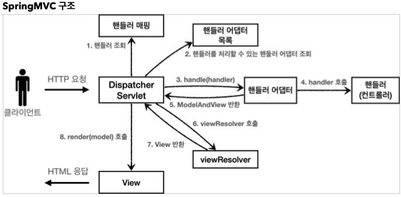

### Spring MVC - 1 



* DispatcherServlet
    - org.springframework.web.servlet.DispatcherServlet
    - HttpServlet 상속 받아 사용, 서블릿으로 동작
    - 스프링 부트는 DispatcherServlet을 서블릿으로 자동으로 등록하면서 `urlPattern="/"` 에 대해 매핑한다

* 요청흐름
    - 서블릿이 호출되면 HttpServlet이 제공하는 service()가 호출
    - DispatcheServlet은 부모 클래스가 service를 오버라이드
    - 부모 클래스를 service 시작으로 여러 메서드가 호출되면서 DispatcheServlet.doDispatch() 호출

* 동작 순서
1. 요청
2. 핸들러 조회 : 핸들러 매핑을 통해 요청 URL에 매핑된 핸들러(컨트롤러)를 조회
3. 핸들러 어뎁터 조회 : 핸들러를 실행할 수 있는 핸들러 어댑터를 조회
4. 핸들러 어뎁터 실행 : 핸들러 어뎁터 실행
5. ModelAndView 반환 : 핸들러가 반환하는 정보를 ModelAndView로 변환해서 반환
6. viewResolver 호출 : 뷰 리졸버를 찾고 실행한다.
    - JSP (InternalResourceViewResolver)가 자동등록
7. View 반환 : 뷰 리졸버는 뷰의 논리 이름을 물리이름으로 바꾸고, 렌더링 역할을 담당하는 뷰 객체를 반환
8. 뷰 렌더링 : 뷰를 통해 뷰를 렌더링

* 핸들러 매핑과 핸들러어뎁터
    - HandlerMapping
        - 우선순위
            - RequestMappingHandlerMapping
            - BeanNameUrlHandlerMapping
    - HandlerAdapter
        - 우선순위
            - RequestMappingHandlerAdapter
            - HttpRequestHandlerAdapter
            - SimpleControllerHandlerAdapter

* 뷰리졸버
    - 우선순위
        - BeanNameViewResolver : 빈 이름을 찾아 반환
        - InternalResourceViewResolver - JSP를 처리할 수 있는 뷰를 반환
        - 호출
            - `new-form` 이라는 뷰를 반환한다고 하면 BeanViewResolver는 new-form이라는 스프링 빈으로 등록된 뷰를 찾는다. -> 등록되어있지 않다.
            - InternalResourceViewResolver 호출
        - InternalResourceView는 JSP 포워드를 호출해서 처리할 수 있는 경우에 사용
        - view render() 호출되고 foward()를 사용해서 JSP 실행

* @RequestMapping
    - RequestMappingHandlerMapping
    - RequestMappingHandlerAdapter
    - 제일 많이쓰는 annotation

* @Controller
    - 스프링이 자동으로 빈으로 등록(내부에 @Component있어 component-scan 대상)
    - 요청정보 매핑
    - ModelAndView : 모델과 뷰 정보를 반환

#### 코드 리팩토링 과정

* v1
    - 서블릿 -> ModelAndView를 리턴
    - RequestMapping을 통해 RequetMappingHandler, RequetMappingAdapter 등으로 ModelAndView 반환
    - 각 컨트롤러 각각 데이터 처리

```java

@Controller
public class SpringMemberFormControllerV1 {

    @RequestMapping("/springmvc/v1/members/new-form")
    public ModelAndView process() {
        return new ModelAndView("new-form");
    }
}

````

```java
@Controller
public class SpringMemberListController {

    final MemberRepository repository = MemberRepository.getInstance();

    @RequestMapping("/springmvc/v1/members")
    public ModelAndView process() {
       List<Member> members = repository.findAll();
       ModelAndView mv = new ModelAndView("members");
       mv.addObject("members", members);
       return mv;
    }

}

```

```java
@Controller
public class SpringMemberSaveControllerV1 {

    final MemberRepository repository = MemberRepository.getInstance();

    @RequestMapping("/springmvc/v1/members/save")
    public ModelAndView process(HttpServletRequest request, HttpServletResponse response) {
        String username = request.getParameter("username");
        int age = Integer.parseInt(request.getParameter("age"));

        Member member = new Member(age, username);
        repository.save(member);

        ModelAndView mv = new ModelAndView("save-result");
        mv.addObject("member", member);
        return mv;

    }
}

```
* v2
    - 모든 요청을 한 컨트롤러에서 받는다
    - 클래스 레벨에서 요청, 메서드 레벨에서 처리

```java
@Controller
@RequestMapping("/springmvc/v2/members")
public class SpringMemberControllerV2 {

    final MemberRepository repository = MemberRepository.getInstance();

    @RequestMapping("/new-form")
    public ModelAndView newForm() {
        return new ModelAndView("new-form");
    }

    @RequestMapping("")
    public ModelAndView list() {
        List<Member> members = repository.findAll();
        ModelAndView mv = new ModelAndView("members");
        mv.addObject("members", members);
        return mv;
    }

    @RequestMapping("/save")
    public ModelAndView save(HttpServletRequest request, HttpServletResponse response) {
        String username = request.getParameter("username");
        int age = Integer.parseInt(request.getParameter("age"));

        Member member = new Member(age, username);
        repository.save(member);

        ModelAndView mv = new ModelAndView("save-result");
        mv.addObject("member", member);
        return mv;

    }
}
````


* v3
    - ModelAndView => String 논리이름 반환
    - Model => 반환 시 모델에 데이터를 담아줌으로 같이 리턴
    - RequestParam => HttpRequest 요청 파라미터를 @RequestParam("username") 식으로 받는다. Get, Post 지원
    - @RequestMapping => @GetMapping, @PostMapping -> 내부적으로 RequestMapping을 가지고 있다.

```java
@Controller
@RequestMapping("/springmvc/v3/members")
public class SpringMemberControllerV3 {

    final MemberRepository repository = MemberRepository.getInstance();

    @GetMapping("/new-form")
    public String newForm() {
        return "new-form";
    }

    @PostMapping("")
    public String members(Model model) {
        List<Member> members = repository.findAll();
        model.addAttribute("members", members);
        return "members";
    }

    @PostMapping("/save")
    public String save(@RequestParam("username") String username,
                             @RequestParam("age") int age,
                             Model model) {
        Member member = new Member(age, username);
        repository.save(member);
        model.addAttribute("member", member);
        return "save-result";
    }
}
```
    