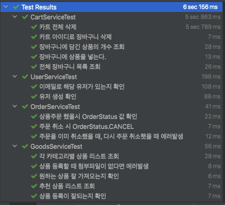
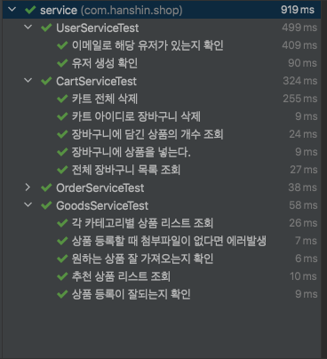

> 서비스 테스트 코드

# 서비스 테스트 코드 개선

### 목표
- 임베디드 레디스 활용
    - `testImplementation group: 'it.ozimov', name: 'embedded-redis', version: '0.7.1'`
- 디비의 H2를 활용함으로써 (인 메모리 형태) 깃에서 클론을 받고 바로 테스트코드를 실행해도 어떠한 제약없이 바로 실행될 수 있게 변경
    - H2는 이미 적용해 놓음
- 속도
    - 토스 컨퍼런스(Slash 21)의 테스트 커버리지 100%를 본 후, 나도 테스트코드 리팩토링을 할 수 있지 않을까? 
        - 속도를 생각하지 않고 기다리기만했다(멍청했다.) 
    - 현재 @SpringbootTest를 상속받고 있어 테스트 실행 시 내 프로젝트 문제
        - 모든 테스트 클래스가 상속을 받고 있다.
        - 모든 Bean을 로드하기 때문에 무겁다
        - 테스트 단위가 크다

```java
// 모든 클래스들이 이 클래스를 상속받아 사용하고 있다.
@ActiveProfiles("test")
@SpringBootTest
@AutoConfigureMockMvc
@Transactional(readOnly = true)
public abstract class IntegrationTests {

    @Autowired
    public MockMvc mvc;
    public static ObjectMapper objectMapper = new ObjectMapper();
}
 
```

### 먼저 서비스코드에 대한 속도를 확인


- 왠지는 모르겠으나, 카트전체삭제에서 5초가 걸리는대, 해당 클래스를 테스트를 돌리면 1초 미만이다.
- 밑의 메서드는 레디스에 장바구니에 담겨있는 상품들을 제거해주는 로직이다.
- 그래서 디비에서도 제거하고, 레디스에서도 제거해준다.
- 그래서 레디스에서 제거할 데이터가 없으니 시간이 걸리는 것 같아 테스트 메서드 순서를 변경했지만 결과는 동일.
 
> 2022-01-06 16:53:40.611  INFO 93266 --- [           main] io.lettuce.core.EpollProvider            : Starting without optional epoll library
> 2022-01-06 16:53:40.612  INFO 93266 --- [           main] io.lettuce.core.KqueueProvider           : Starting without optional kqueue library

- 위의 두 라이브러리가 시간을 잡아먹는것 같다.
    - 해당 메서드에서 캐시 관련된 어노테이션을 제거하면 잘 나온다.
- 개선 방법
    - 도커로 먼저 레디스 서버를 띄우고 나서 작업을 하면 속도가 빨라진다.
    - 하지만 다른 누군가가 로컬에서 도커를 켜야하는대 좋은 방법이 없는지 좀 더 찾아봐야겠다.



```java

    @Transactional
    @CacheEvict(key = "#userId", value = "cart")
    public int deleteAll(Long userId) {
        final List<CartVO> all = cartMapper.findAll(userId);

        if (all.isEmpty() || all.size() == 0) {
            throw new IllegalStateException("삭제할 상품이 없습니다.");
        }
        return cartMapper.deleteAll(userId);
    }

```

 ### Ref.

* <https://sg-choi.tistory.com/543>
* <https://tecoble.techcourse.co.kr/post/2021-05-18-slice-test/>