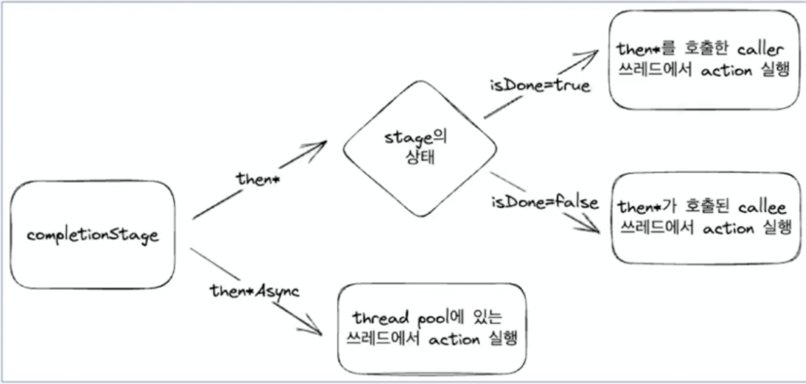

> Spring webflux

## 장점, 단점
- 장점
    - 효율적인 리소스 사용
    - 요청이 순간적으로 늘어나도 유연하게 커버
    - 동시성을 극한으로 응답속도 단축
- 단점
    - 비동기로직 처리에 고민
    - 디버깅, 에러핸들링 어려움


## Reactive
- 동기와 비동기, Blocking과 Non-Blocking의 차이점은?
- Reactive system의 필수요소
- Reactive streams의 구조는?
- Java nio는 어떻게 동작하는가, java io의 차이는?
- Reactor pattern을 사용해서 어떤일을 하는가?
- Reactive는 무엇인가?


### 비동기란?
- Caller, Callee
    - Caller : 호출하는 함수
    - Callee : 호출 당하는 함수
- 동기
    - Caller는 Callee의 결과에 관심이 있다.
    - Caller는 결과를 이용해 action을  취한다.
- 비동기
    - Caller는 Callee의 결과에 관심이 없다.
    - Callee는 결과를 이용하여 callback을 수행한다.
- 함수형 인터페이스
    - `호출한 쓰레드에서 실행된다` 
- Blocking
    - Caller는 Callee가 완료되기 전까지 아무것도 할 수 없다
    - 제어권을 Callee가 가지고 있다.
    - caller와 다른 별도의 스레드가 필요하지 않다.
- Non-blocking
    - Caller는 본인의 일을 할 수 있다.
    - 제어권을 Caller가 가지고 있다.
    - caller와 다른 별도의 스레드가 필요하다. (다른 일을 해야하기 때문에)

||동기|비동기|
|Blocking| caller는 결과에 관심있고 아무것도 할 수 없다.| Caller는 아무것도 할 수 없고 결과는 Callee가 처리한다.|
|NonBloking|Caller는 결과에 관심있고 얻은 후에 직접 할 수 있다.| Caller는 자기할 일을 할 수 있고, 결과는 Callee가 처리한다.|


### CompletableFuture
- Future
    - 비동기적인 작업 수행
    - 해당 작업이 완료되면 결과를 반환하는 인터페이스
- CompletionStage
    - 비동기적인 작업 수행
    - 해당 작업이 완료되면 결과를 처리하거나 다른 CompleStage를 연결하는 인터페이스
- ExecutorService
    - 스레드 풀을 이용하여 비동기적으로 작업을 실행하고 관리
    - 별도의 스레드를 생성하지 관리하지 않아도 되므로, 코드를 간결하게 유지가능
    - 스레드 풀을 이용하여 자원을 효율적으로 관리
    - thenAccept
        - done 상태에서 caller의 쓰레드에서 실행
        - caller 쓰레드에서 block을 할 수 있다.
- ForkJoinPool -> `CompletionStage 내부적으로 사용`
    - thread pool
    - 기본 size = 할당된 cpu 코어 - 1
    - 데몬스레드 : main 스레드가 종료되면 즉각적으로 종료
    - Task를 fork를 통해 substask로 나눈다.
    - steal work 알고리즘을 이용해 균등하게 처리
    - join을 통해 결과를 생성
- 한계
    - 지연로딩 기능을 제공 X
        - CompletableFuture를 반환하는 함수 호출 시 즉시 작업이 실행
    - 지속적으로 생성되는 데이터를 처리하기어렵다.

#### CompletionStage 인터페이스

```java
public interface CompletionStage<T> {
    public <U> CompletionStage<U> thenApply(Function<? super T,? extends U> fn);
    public <U> CompletionStage<U> thenApplyAsync(Function<? super T,? extends U> fn);
    
    public CompletionStage<Void> thenAccept(Consumer<? super T> action);
    public CompletionStage<Void> thenAcceptAsync(Consumer<? super T> action);
    
    public CompletionStage<Void> thenRun(Runnable action);
    public CompletionStage<Void> thenRunAsync(Runnable action);
    
    public <U> CompletionStage<U> thenCompose(Function<? super T, ? extends CompletionStage<U>> fn);
    public <U> CompletionStage<U> thenComposeAsync(Function<? super T, ? extends CompletionStage<U>> fn);
    
    public CompletionStage<T> exceptionally(Function<Throwable, ? extends T> fn);
}
```


- 모든 then*Async 연산자는 executor를 추가 인자로 받음
- 이를 통해 다른 스레드풀로부터 task를 실행할 수 있음

- thenAccept[Async]
    - Consumer를 파라미터로 받음
    - 이전 task로 값을 받지만, 값을 넘기지는 않음
    - 다음 task에게 null을 넘김
    - thenAccept: 현재 스레드에서 실행
    - thenAcceptAsync: 별도의 스레드에서 실행(forkJoinPool)
    - done 상태에서 thenAccept는 caller(main)에서 실행 시
        - done 상태에서의 completionStage에 thenAccept를 사용하는 경우, caller의 스레드를 block 할 수 있음
    - done 상태가아닌 thenAccept는 callee(forkJoinPool)의 스레드에서 실행 
        - done 상태가 아닌 completionStage에 thenAccept를 사용하는 경우, callee의 스레드를 블록할 수 있음

- thenApply[Async]
    - Function을 파라미터로 받음
    - 이전 Task로부터 T 타입의 값을 받아 가공하여 U 반환
    - 다음 Task에게 반환했던 값 전달
    - 값을 변형해야할 때 사용

- thenCompose[Async]
    - Function을 파라미터로 받음
    - 이전 Task로부터 T 타입의 값을 받아 가공 후 U 타입의 CompletionStage를 반환
    - 다른 CompletionStage가 Done 상태가되면 다음 Task에게 전달
    - 다른 future를 반환해야하는 경우 유용

- thenrun[Async]
    - Runnable 파라미터로 받음
    - 이전 task로부터 값을 받지도 전달하지도 않음
    - 다음 task에게 null 전달
    - future가 완료되었다는 이벤트를 기로할 때 유용

- exceptionally
    - Function을 파라미터로 받음
    - 이전 Task에서 발생한 에러를 받아 처리
    - 다음 Task에게 반환된 값을 전달

#### CompletableFuture 

```java
public class CompletableFuture<T> implements Future<T>, CompletionStage<T> {
    public static <U> CompletableFuture<U> supplyAsync(Supplier<U> supplier) { ... };
    public static CompletableFuture<Void> runAsync(Runnable runnable) { ... };
    
    public boolean complete(T value) { ... };
    public boolean isCompletedExceptionally() { ... };
    
    public static CompletalbeFuture<Void> allOf(CompletableFuture<?>... cfs) { ... };
    public static CompletableFuture<Object> anyOf(CompletableFuture<?>... cfs) { ... };
}
```

- supplyAsync
    - Supplier를 제공하여 CompletableFuture를 생성 가능
    - Supplier의 반환 값이 CompletableFuture로 반환
- runAsync
    - Runnable을 제공하여 CompletableFuture를 생성 가능
    - 값 반환하지 않음
    - 다음 Task에게 null 전달
- complete
    - CompletableFuture가 완료되지 않았다면 주어진 값으로 채움
    - complete에 의해서 상태가 바뀌었다면 true, 아니면 false
- allOf
    - 여러개 CompletableFuture를 하나로 모아 하나의 CompletableFuture 반환
    - 모든 CompletableFuture가 완료되면 상태가 done으로 변경
    - Void를 반환하므로 각각의 값을 get으로 조회해야함
    ```java
        return CompletableFuture.allOf(imageFuture, articlesFuture, followCountFuture)
                .thenAcceptAsync(v -> log.info("futures are completed"))
                .thenApplyAsync(v -> {
                    try {
                        var image = imageFuture.get();
                        var articles = articlesFuture.get();
                        var followCount = followCountFuture.get();
                        return Optional.of(
                                new User(
                                        user.getId(),
                                        user.getName(),
                                        user.getAge(),
                                        image,
                                        articles,
                                        followCount
                               ));
                    } catch (Exception e) {
                        throw new RuntimeException(e);
                    }
                });
    ```

- anyOf
    - 여러개 CompletableFuture를 하나로 모아 하나의 CompletableFuture 반환
    - 주어진 future 중 하나라도 완료되면 상태가 done으로 변경
    - 제일 먼저 done 되는 값이 future로 반환
- 한계
    - 지연로딩기능을 제공하지 않음
         - CompletableFuture를 반환하는 함수를 호출 시 즉시 작업이 실행
    - 지속적으로 생성되는 데이터를 처리하기가 어려움
        - CompletableFuture에서 데이터 반환하고 나면 다시 다른 값을 전달하기가 어려움