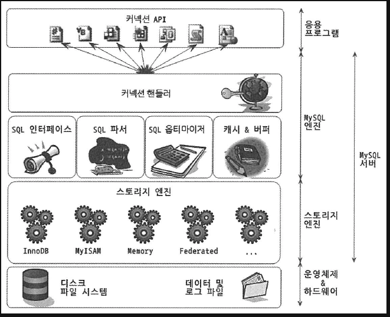
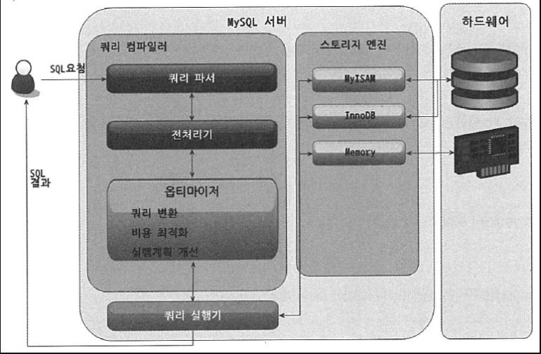
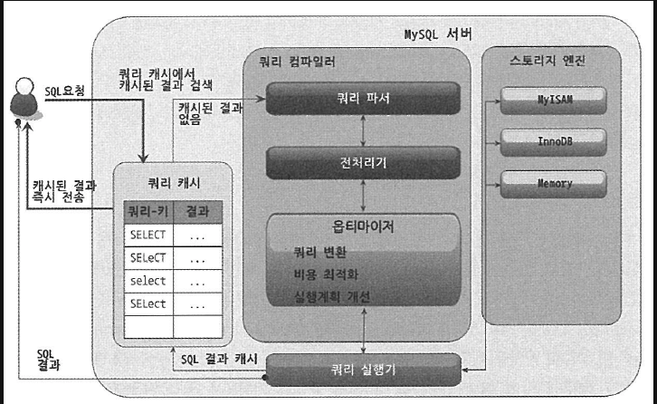

> RealMySQL

## 설정 정보
- tmpdir 
    - 서버는 정렬이나 그룹핑 같은 처리를 위해 내부저긍로 임시 테이블을 생성한다. 임시 데이터 파일이 저장되는 위치이며, 쿼리가 종료되면 자동으로 삭제된다.
- character-set-server, collation-server
    -  기본 문자집합 설정, 별도로 DB나 테이블 또는 컬럼에서 사용할 문자집합을 오버라이딩을 하지 않으면 이 설정으로 사용된다. 컬럼에서는 대소문자를 구분하지 않는것이 default, 설정하고싶다면 collation-server에 `utf8_bin`을 설정한다.
- event-scheduler
    - 5.1버전부터 유닉스의 크론과 같일 일정 시간에 반복되는 작업을 목적으로 사용할 수 있다.
- sysdate-is-now: 현재 시간을 가져오는 sysdate(), now() 함수가 있는대, 사용자에게 동일한 것처롬 보이지만 큰 차이점이 있다. 
    - 하나의 SQL에서 모든 NOW() 함수는 같은 값을 가지지만, SYSDATE() 함수는 하나의 SQL에서도 시점에 따라 결과값이 달라진다.
    ```sql
    SELECT NOW(), SLEEP(2), NOW(); // 2023-05-09 17:24:03 0 2023-05-09 17:24:03
    SELECT SYSDATE(), SLEEP(2), SYSDATE(); 2023-05-09 17:24:03 0 2023-05-09 17:24:05
    ```
    - 2초의 차이가 있다.
    - 첫번째 SYSDATE() 함수가 사용된 SQL은 안정적으로 복제가 되지못한다.
    - SYSDATE() 함수와 비교되는 컬럼은 인덱스를 효율적으로 사용하지 못한다.
- back_log
    - 수많은 클라이언트가 서버에 접근을하면 서버의 인증을 거칠때까지 기다리게되는대, 몇 개까지의 커넥션을 대기 큐에 담아 둘지 결정하는 설정
- max_connections
    - Mysql 서버가 최대한 허용할 수 있는 클라이언트의 연결 수를 제한하는 설정
    - 이 설정을 수천으로 늘릴 수록 MySQL 서버가 죽을 활률이 높다.
    - 적절한 수를 설정하여, 디비서바가 죽지 않도록한다. => 차라리 웹 서버가 죽는게 낫다.
        - `디비 서버는 영구적인 데이터를 관리하기 때문에..`
- thread_catch_size
    - 디비 서버에서 스레드와 커넥션은 같은 의미로 사용되곤 했지만, 사실 커넥션은 클라이언트와 서버와의 연결 그 자체이며, 스레드는 해당 커넥션으로부터 오는 작업 요청을 처리해주는 주체이다.
    - 최초 클라이언트로 요청이오면 디비서버에 스레드를 준비해 그 커넥션에 작업 요청을 처리해줄 스레드를 매핑하는 형태이다.
    - 스레드가 경량이더라도 생성하는데에 시간과 CPU 리소스가 필요하기 때문에 커넥션이 불필요해진 스레드는 커넥션 풀에 젖아해뒀다가 새로운 요청이오면 할당한다.
    - 최대 몇개까지의 스레드를 스레드 풀에 보관할지 결정한다.
- wait_timeout: 지정된 시간동안 아무런 요청없이 대기하는 경우 커넥션을 강제로 종료한다. 
    - 28800초(8시간) 이 기본값으로 설정되어 있다.
- max_allowed_packet
    - 네트워크문제나 디비 또는 클라이언트 버그로 인하여 MySQL 서버로 잘못된 패킷이 전달될 경우 서버에 심각한 문제가 될 수 있다.
    - 이러한 문제점을 없애고자 해당 설정을 크기 이하일 것으로 간주하고 개발한다.
    - MySQL 서버와 통신할 때 클아이언트가 서버로 쿼리를 보내는 경우에는 무조건 하나의 패킷만 사용할 수 있다.
- transaction-isolation
    - transaction 격리 수준을 셜정하는 값
    - 기본 값은 Repeatable-read

## MySQL 구조


- MySQL 서버는 크게 엔진과 스토리이 엔진으로 구분해서 볼 수 있다.
- 엔진: 클라이언트로부터 접속 및 쿼리 요청을 처리하는ㄴ 커넥션 핸들러와 SQL 파서 및 전처리기, 옵티마이저가 중심을 이룬다.
- 스토리지: SQL 문장을 분서갛거나 최적화하는 등 DBMS의 두뇌에 해당하는 처리를 수행하고 실제 데이터를 디스크 스토리지에 READ/WRITE 역할을 한다.

## 쿼리 실행구조

- 파서: 사용자 요청으로 들어온 쿼리 문장을 토큰으로 분리해 트리 형태의 구조로 만들어내는 작업을 의미, 쿼리 문장의 기본 문법오류는 이 과정에서 발견되며 사용자에게 메시지로 전달
- 전처리기: 파서 과정에서 만들어진 파서 트리를 기반으로 쿼리 문장에 구조적인 문제점이 있는지 확인, 각 토큰을 테이블 이름이나 컬럼 이름 또는 내장 함수와 같은 개체를 매핑해 해당 객체의 존재 여부와 객체의 접근권한등을 확인하는 과정을 수행한다.
- 옵티마이저: 사용자의 요청으로 들어온 쿼리 문장을 저렴한 비용으로 가장 빠르게 처리할지 결정하는 역할 => DBMS의 두뇌
- 실행 엔진
    1. 핸들러에게 임시테이블 생성요청
    2. where 절에 일치하는 레코드를 읽어오라고 핸들러에게 요청
    3. 읽어온 데이터를 1번에서 준비한 임시테이블로 저장하라고 다시 요청
    4. 데이터가 준비된 임시 테이블에서 필요한 방식으로 데이터를 읽어오라고 다시 요청
    5. 최종적으로 실행엔진은 결과를 사용자나 다른 모듈에게 넘김

## 복제 (Replication) -> 궁금했던 내용
- 디비의 데이터가 갈수록 대용량화 되어 가는것을 생각하면 확장성은 필수이다. => `복제`
- 2대 이상의 Mysql 서버가 동일한 데이터를 담도록 실시간으로 동기화하는 기술
- 일반적으로 복제에는 insert, update와 같은 쿼리를 이용해 데이터를 변경할 수 있는 Mysql 서버와 select 쿼리로 데이터를 읽기만하는 Mysql 서버로 나뉜다.
    - master / slave
    - master: MYSQL의 바이너리 코드가 활성화가 되면 어떤 서버든 마스터가 될 수 있다. 마스터 장비는 모든 쿼리문장은 바이너리 로그에 기록된다. 슬레이브 서버에서 변경 내역을 요청하면 마스터 장비는 그 바이너리 로그를 넘겨준다. 마스터 장비의 프로세스 가운데 `Binlog dump` 라는 스레드가 이 일을 전담. 마스터 하나에 슬레이브 10개가 연결되어있따면 Binlog Dump 스레드는 10개다.
    - slave: 데이터(바이너리 로그)를 받아올 때 마스터 장비의 정보(IP, 접속 계정)을 가지고 있는 경우 슬레이브가 된다. 마스터가 바이너리 로그를 가지고 있다면 슬레이브는 릴레이 로그를 가지고 있다. 별도의 빌드나 설정할 필요가 없다. 일반적으로 데이터의 동기화를 유지하기 위해 ReadOnly로 설정하는 경우가 많다. 슬레이브 서버에 SQL 스레드가 릴레이로그에 기록 된 변경 내역을 재실행 함으로써 슬레이브의 데이터를 마스터와 동일한 상태로 유지한다.
    - SQL 기반의 복제는 아무리 많은 데이터의 변경을 많이 유발하는 쿼리라 하더라도 SQL 문잔 하나만 슬레이브로 전달되어 네트워크 비용이 많이 유발되지 않는다. 하지만 정상적으로 작동하려면 `Repeatable read` 이상의 트랜잭션 격리수준을 유지해야한다.
- 주의사항
    - 슬레이브는 하나의 마스터만 설정 가능하다.
    - 마스터와 슬레이브는 동기화를 위하여 슬레이브를 읽기 전용으로 설정한다.
    - 슬레이브 서버용 장비는 마스터와 동일한 사양으로한다.
        - 수많은 동시사용자가 실행한 데이터 변경 쿼리 문장이 슬레이브 서버에서는 하나의 스레드로 모두 처리돼야한다. 변경이 매우 잦은 서버일수록 슬레이브 서버의 사양이 더 좋아야 여러개의 스레드로 실행된 쿼리가 슬레이브에서 지연되지 않고 하나의 스레드로 처리할 수 있다.
    - 복제가 불필요한 경우에는 바이너리 로그 중지
        - 바이너리 로그를 작성하기 위해 엄청나게 많은 자원을 소모하고, 성능이 저하된다.
        - 바이너리 로그를 안정적으로 기록하기 위해서 갭 락을 유지하고, 매번 트랜잭션이 커밋 될 때마다 데이터를 변경시킨 쿼리 문장을 바이너리 로그에 기록해야한다. 
        - 바이너리 로그를 기록하는 작업은 보통 AutoCommit이 활성화된 서버에서 심각한 부하로 나타날 때가 많다.
    - 바이너리로그와 트랜잭션 격리 수준

## 쿼리 캐시

- 타 DBMS에는 없는 MySQL의 독특한 기능
- 상당한 성능향상
- 복잡한 쿼리를 쿼리 캐시에 담아두고, 동일한 쿼리 요청이 왔을 때 기대 이상의 효과를 받을 수 있다.
- 쿼리 캐시는 의미와는 달리 SQL 문장을 캐시 하는것이 아니라 쿼리의 결과를 메모리에 캐시 하는 기능이다. 
- 구조는 맵과 같은 구조로 되어있고, 키를 구성하는 요소 가운데 가장 중요한 것은 쿼리 문장 자체이다.
    - 절차
    1. 요청된 쿼리 문장이 쿼리 캐시에 존재하는가?
        - 문자열 자체가 동일해야됨(공백 대소문자등)
    2. 해당 사용자가 그 결과를 볼 수 있는 권한을 가졌는가?
    3. 트랜잭션 내에서 실행된 쿼리의 경우, 그 결과가 가시 범위 내의 트랜잭션에서 만들어진 결과인가?
    4. 쿼리에 사용된 기능이 캐시돼도 동일한 결과를 보장하는가?
    5. 캐시가 만들어지고 난 이후 데이터가 다른 사용자에 의해 변경되지 않았는가?
    6. 쿼리에 의해 만들어진 결과가 캐시하기에 너무 크지 않은가?

## InnoDB 스토리지 엔진 특성
- primary key에 의한 클러스터링
    - 모든 테이블은 기본적으로 프라이머리 키를 기준으로 클러스터링되어 저장된다. 프라이머리 키값의 순서대로 디스크에 저장되고, 레인지스캔은 상당히 빨리 처리된다.
- 잠금이 필요없는 일관된 읽기
    - Multi Version Concurrency Control 이라는 기술을 이용해 락을 걸지 않고 읽기 작업을 수행. 읽기 작업은 다른 트랜잭션이 가지고 있는 락을 기다리지도 않는다.
- 외래키 지원
- 자동 데드락 감지
    - 그래프 기반의 데드락 체크방식을 사용하기 때문에 데드락이 발생함과 동시에 바로 감지되고 감지된 데드락은 관련 트랜잭션 중에 Rollback이 가장 용이하다.
- 자동화된 장애복구
    - 손실이나 장애로부터 데이터를 보호하기 위한 여러 메카니즘이 탑재
- 오라클의 아키텍쳐 적용

## MySQL 로그파일
- 에러 로그파일
    - 실행되는 도중에 발생하는 에러나 경고 메시지가 출력되는 로그파일 `log_error` 파일이름이다. 별도로 정의되지 않은 경우에는 datadir 파라미터에 .err 확장자로 붙은 파일
    - MySQL 시작하는 과정과 관련된 정보성 및 에러메시지
        - 컨피그 파일을 변경하거나 디비가 비정상적으로 종료되면 반드시 에러로그파일을 통해 설정된 변수의 이름이나 값이 명확하게 설정되었는지 확인해야한다.
        - mysqld started 메시지 확인
        - 새로 변경하거나 추가된 파라미터에 대한 특별한 에러나 경고성 메시지가 없다면 정상적으로 적용된 것으로 판단하면된다.
    - 쿼리 처리 도중에 발생하는 문제에 대한 에러메시지
        - 이 문제점은 사전예방이러엽다. 주기적으로 에러로그파일을 확인하여 알아야한다.
- 슬로우 쿼리 로그
    - 쿼리 튜닝은 크게 서비스가 적용되기 전에 전체적으로 튜닝하는 경우와 서비스 운영 중에 MySQL 서버의 전체적인 성능저하를 검사하거나 또는 정기적인 점검을 위한 튜닝으로 나눌 수 있다.
    - 전자의 경우 검토해야할 대상 쿼리가 전부가 아니라서 모두 튜닝하면 되지만, 후자의 경우에는 어떤 쿼리가 문제인지 판단하기 어렵다. => 이럴 때 슬로우 쿼리로그가 도움이 된다.
    - 슬로우 쿼리로그 파일은 정의한 시간 이상의 소요된 쿼리가 기록이된다. 소요된 시간을 기준으로 슬로우 쿼리 로그에 기록할지 판단하기 때문에 반드시 쿼리가 정상적으로 실행되어야 슬로우 쿼리 로그에 기록될 수 있다. 즉 슬로우 쿼리 로그 파일에 기록되는 쿼리는 정상적으로 실행이 완료되었고 걸린시간이 `long_query_time` 에 정의된 초보다 많이 걸린 쿼리이다.

